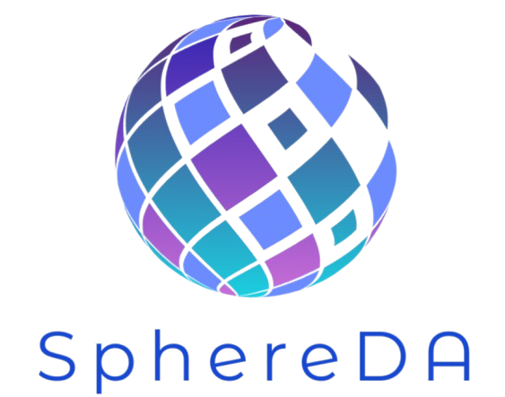

# SphereDA

  

## Introduction

SphereDA is a neural network-based data assimilation system designed to enhance the initialization of numerical weather prediction models. The framework employs deep learning techniques to efficiently combine observational data with model first-guess fields, creating optimized initial conditions for atmospheric forecasting.

### Key Features
- Neural network-based data assimilation methodology
- Support for multiple meteorological data formats (BUFR, NetCDF)
- Automated data preprocessing and quality control
- Observation operator implementation
- First-guess field integration capabilities
- Scalable processing for operational applications

The system's core strength lies in its innovative approach to data assimilation, leveraging machine learning to optimize the combination of diverse meteorological observations with model background states. This methodology aims to improve the accuracy and computational efficiency of the initialization process, ultimately contributing to enhanced forecast quality.

---
